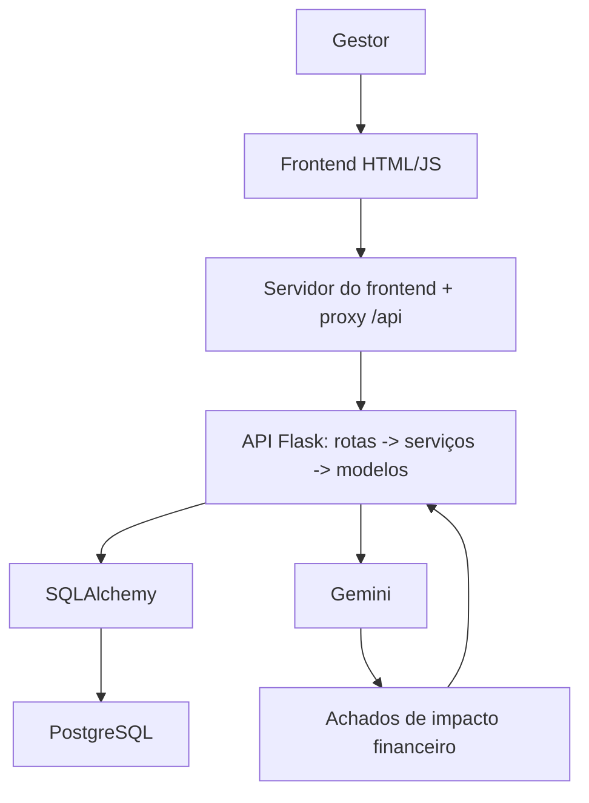

# Gestor de Contratos

## Execução atual do CP2

O sistema local tem três componentes: API Flask/PostgreSQL (pacote `api/`), proxy same-origin e servidor das páginas (`frontend/servidor.py`) e frontend HTML/CSS/JavaScript (`frontend/public/`). A integração externa de análise textual usa a API do Gemini quando `GEMINI_API_KEY` está configurada. Este repositório não contém prova de deploy AWS ativo; as referências antigas a AWS abaixo são histórico do desenho inicial, não instruções de execução local.

### Preparar o ambiente

Na raiz do repositório, crie um ambiente virtual e instale `requirements.txt`:

```bash
python3 -m venv .venv
source .venv/bin/activate
python -m pip install -r requirements.txt
```

Copie `.env.example` para `.env` e preencha os dados do PostgreSQL e uma chave de assinatura própria. Configure `GEMINI_API_KEY` somente se for demonstrar análise real; os testes simulam o provedor e não precisam dessa chave.

Antes de apontar para um banco existente, leia e aplique manualmente, na ordem, as migrações `database/migrations/001_cliente_usuario_id.sql` a `005_fk_cascade_e_indices.sql`. A migração 004 interrompe a operação se houver contratos legados sem proprietário: atribua-os explicitamente antes de repetir. As migrações não foram executadas neste ambiente nem contra o RDS.

Abra dois terminais na raiz:

```bash
python -m api
```

```bash
python -m frontend.servidor
```

A aplicação é servida em `http://127.0.0.1:8000`; a API em `http://127.0.0.1:5000`, encaminhada pelo frontend em `/api`. Swagger UI: `http://127.0.0.1:5000/swagger/`.

### Estrutura do projeto

```text
.
├── api/                      API Flask (arquitetura em camadas)
│   ├── __init__.py           create_app(): monta app, CORS, Swagger e rotas
│   ├── __main__.py           python -m api
│   ├── config.py             configuração lida do ambiente
│   ├── extensions.py         db (SQLAlchemy) e salvar()
│   ├── exceptions.py         ErroAplicacao (erro de negócio -> JSON)
│   ├── errors.py             tratadores de erro HTTP
│   ├── seguranca.py          token e decoradores @autenticado / @administrador
│   ├── utils.py, http.py     conversões de dados e leitura do corpo JSON
│   ├── models/               entidades do banco, um arquivo por tabela
│   ├── services/             regras de negócio e validações (sem Flask)
│   ├── routes/               blueprints finos: HTTP -> serviço -> JSON
│   ├── integrations/         provedores externos (Gemini)
│   └── static/swagger.json   especificação OpenAPI
├── database/migrations/      scripts SQL aplicados manualmente, em ordem
├── frontend/
│   ├── servidor.py           servidor das páginas e proxy /api -> API
│   └── public/               HTML, css/ e js/ servidos ao navegador
├── tests/                    pytest (SQLite em memória)
├── docs/                     auditoria do CP2 e instruções do agente
├── .env.example, requirements.txt, pytest.ini
```

Fluxo de uma requisição: `routes` lê a requisição → `services` aplica as regras e acessa os `models` → a rota devolve JSON. Os serviços sinalizam falhas com `ErroAplicacao`, que vira `{"erro": ...}` com o código HTTP correto.

### Testes

```bash
pytest -q
```

Os testes usam SQLite em memória (`tests/conftest.py` cria a aplicação com `create_app()` apontando para SQLite e ainda define `DATABASE_URL=sqlite://` como rede de segurança, então o banco real nunca é tocado) e simulam chamadas ao Gemini. Eles não certificam a conexão com RDS nem a disponibilidade/quota do provedor.

### Limites atuais e apresentação

O dashboard agrega carteira, vencimentos e a contagem de cláusulas de alto impacto (considera a correção feita na revisão e ignora as descartadas). Ele carrega apenas os 100 contratos mais recentes para as tabelas; totais e gráfico por tipo vêm de `/dashboard/resumo`. O contrato pode ser editado pela tela de detalhe (`PUT /contratos/{id}`). A análise envia somente descrições de cláusulas, bloqueia padrões comuns de dados pessoais e valida a resposta; isso não substitui revisão jurídica. O resultado deve ser conferido no contrato original. O link do Trello informado pelo grupo fica na seção final; confirme e atualize o quadro antes da apresentação.

### Evolução em relação à versão inicial (CP1)

Comparação com o commit `f3b6ccd` (04/10), anterior às mudanças do CP2.

| Área | Versão inicial | CP2 |
|---|---|---|
| Segurança | Qualquer usuário logado via todos os contratos; o papel podia ser definido no cadastro; `debug=True` em `0.0.0.0` | Isolamento por usuário (dado de outro usuário responde 404), autocadastro sempre como `usuario`, `debug` só com `FLASK_DEBUG=1` |
| Backend | Um único `api/app.py` | Pacote em camadas (rotas, serviços, modelos), erros em JSON padronizado e validações (valor, datas, tamanho de texto) |
| API | Listagens completas | Paginação, filtros e `GET /dashboard/resumo` com agregações em SQL |
| Dashboard | Indicadores e gráficos calculados no navegador | Totais vindos do backend, alertas de vencimento, cláusulas de alto impacto e edição do contrato |
| Banco | Tabelas básicas | Dono do contrato obrigatório, chave única de cliente, índices, FKs com cascade e tabelas da análise (migrações em `database/migrations`) |
| LLM | Não havia | Análise de cláusulas com Gemini, saída validada e revisão pelo gestor |
| Documentação | README | README atualizado e Swagger OpenAPI 3 com todas as rotas (a especificação não estava versionada) |
| Testes | Não havia | 38 testes (isolamento entre usuários, autenticação, validações, paginação, edição de contrato, IA simulada) |

## Nome do projeto

**Gestor de Contratos**

---

## Descrição

O **Gestor de Contratos** é um sistema desenvolvido para centralizar o cadastro, a consulta, a atualização e o acompanhamento de contratos e das informações relacionadas a eles.

A solução possui uma interface web e uma API REST desenvolvida em **Python com Flask**. No desenvolvimento local, o backend usa PostgreSQL configurado por variáveis de ambiente; o proxy Flask serve o frontend e encaminha as chamadas para a API.

Além do gerenciamento dos contratos, o sistema usa uma **LLM (Gemini)** para destacar, nas cláusulas contratuais, as obrigações com **impacto financeiro** para a empresa contratante, sempre com revisão do gestor.

A solução integra gerenciamento contratual, banco de dados e análise textual com LLM em uma única aplicação.

---

## Problema escolhido

O gerenciamento de contratos envolve diversas informações importantes, como:

- clientes;
- usuários responsáveis;
- contratos;
- cláusulas;
- aditivos;
- valores;
- datas;
- alterações de status;
- histórico das operações.

Quando essas informações são armazenadas ou controladas de forma descentralizada, o acompanhamento dos contratos se torna mais difícil, aumentando o risco de inconsistências, perda de informações e dificuldade de consulta.

Além disso, a análise manual de todas as cláusulas de um contrato pode ser demorada e complexa. Dependendo da quantidade de documentos e do nível de detalhamento das cláusulas, pode ser difícil identificar rapidamente quais condições contratuais representam maior risco ou impacto para a empresa que pretende firmar o contrato.

---

## Solução proposta

A solução proposta é um **sistema web de gestão de contratos** que reúne funcionalidades de gerenciamento e análise contratual.

O usuário acessa o sistema pela interface web. As páginas chamam `/api/...` no servidor do frontend, que encaminha a requisição para a API REST Flask. A API valida os dados, aplica as regras de negócio e se comunica com o banco PostgreSQL.

Quando o gestor pede a análise de um contrato, a API envia o texto das cláusulas ao Gemini, valida a resposta e a guarda para revisão, apoiando a avaliação do contrato antes da tomada de decisão.

### Fluxo simplificado

```text
Cliente / Usuário
       |
       v
Sistema Gestor de Contratos
Frontend + Backend Flask
       |
       |-------------------------------|
       |                               |
       v                               v
Modelo de IA                     API REST Flask
Análise das cláusulas            Executada pela API Flask
       |                               |
       v                               | SQLAlchemy
Estimativa de risco/impacto             v
para a empresa contratante        PostgreSQL
                                  Amazon RDS
```

---

## Integrantes

| Nome | RM |
| --- | --- |
| Davi Oliveira da Silva | RM569108 |
| João Pedro Morangoni | RM570073 |
| João Vitor Xavier de Carvalho | RM570633 |

---

## Tecnologias utilizadas

- **Python** — linguagem principal utilizada no desenvolvimento;
- **Flask** — framework utilizado no backend do sistema e na construção da API REST;
- **Flask-SQLAlchemy** — integração do Flask com o SQLAlchemy;
- **SQLAlchemy** — ORM utilizado para comunicação com o banco de dados;
- **PostgreSQL** — banco de dados relacional;
- **PostgreSQL** — banco de dados (pode ser hospedado, por exemplo, no Amazon RDS);
- **psycopg2** — driver utilizado para conexão com PostgreSQL;
- **python-dotenv** — carregamento das variáveis de ambiente;
- **Werkzeug** — utilizado em funcionalidades do Flask, incluindo geração segura de hash de senha;
- **Swagger / OpenAPI** — documentação e testes dos endpoints da API;
- **Modelo de Inteligência Artificial** — utilizado para analisar cláusulas contratuais e estimar risco/impacto para a empresa contratante;
- **Git** — controle de versão;
- **GitHub** — hospedagem e versionamento do repositório.

---

# Arquitetura inicial

A arquitetura do projeto é dividida em quatro componentes principais. Veja a seção "Estrutura do projeto" para a organização das pastas.

## 1. Interface do sistema

É o ponto de acesso do usuário ao Gestor de Contratos. Por meio dela, o cliente pode utilizar as funcionalidades de cadastro, consulta e gerenciamento disponibilizadas pelo sistema.

## 2. Servidor do frontend

O `frontend/servidor.py` serve as páginas e encaminha as chamadas `/api/...` para a API, de modo que o navegador fala com uma única origem (sem problemas de CORS).

## 3. API REST Flask

A API (pacote `api/`) recebe requisições HTTP nas rotas, delega as regras de negócio e a validação aos serviços, aplica a autenticação por token e o isolamento por usuário, e retorna JSON. Os métodos usados são `GET`, `POST`, `PUT` e `DELETE`. Os endpoints de listagem de contratos têm paginação e filtros.

## 4. PostgreSQL

O banco PostgreSQL persiste as informações. A comunicação com a API é feita com **SQLAlchemy**.

### Diagrama da arquitetura



---

# Banco de dados utilizado

O projeto utiliza **PostgreSQL** (nos testes, SQLite em memória).

As principais tabelas são:

- `cliente`;
- `usuario`;
- `contrato`;
- `clausula`;
- `aditivo`;
- `historico_status`;
- `analise_contrato` e `resultado_analise_clausula` (análise com IA).

## Justificativa da modelagem

- **Cliente separado de contrato:** um cliente tem vários contratos; evita repetir dados cadastrais. `(usuario_id, documento)` é único, então cada carteira não duplica clientes.
- **Isolamento por usuário:** `contrato.usuario_id` é obrigatório e indexado; toda consulta filtra pelo usuário autenticado.
- **Cláusulas, aditivos e histórico em tabelas próprias** (1:N com `ON DELETE CASCADE`): crescem de forma independente e o histórico preserva a trilha de auditoria de quem verificou o contrato.
- **Análise com IA separada** (`analise_contrato` 1:1 com contrato e `resultado_analise_clausula` 1:N): guarda modelo, versão do prompt e hash do texto (evita reanalisar texto igual) e mantém o resultado original da IA ao lado da correção humana (`*_corrigido`, `status_revisao`).
- **Índices** em `contrato.usuario_id` e nas FKs de cláusula, aditivo e histórico, usados nos filtros e nas agregações do dashboard.

## Relacionamentos principais

- um cliente pode possuir vários contratos;
- um usuário pode estar associado a contratos;
- um contrato pode possuir várias cláusulas;
- um contrato pode possuir vários aditivos;
- um contrato pode possuir vários registros no histórico de status;
- alterações de status podem registrar o usuário responsável pela alteração.

---

# Modelo de Inteligência Artificial

A LLM apoia o gestor a **encontrar, em um contrato, as cláusulas com impacto financeiro** (por exemplo, multa de rescisão de 20% ou reajuste anual). Ela não decide nada sozinha: o gestor confere cada achado e confirma, corrige ou descarta.

| Item | Como funciona neste projeto |
|---|---|
| **Serviço e modelo** | API REST do Google **Gemini** (`generateContent`). O modelo vem de `GEMINI_MODEL` (padrão no código: `gemini-3.8-flash`). A chave fica em `GEMINI_API_KEY`. |
| **Finalidade** | Classificar o texto das cláusulas: tipo da obrigação, valor ou percentual e nível de impacto (baixo, médio ou alto), citando o trecho original. |
| **Dados enviados** | Somente a **descrição das cláusulas** do contrato, juntadas em um texto (até 30.000 caracteres). Não vão cliente, número do contrato, valores cadastrados nem dados do usuário. |
| **Resposta obtida** | JSON com a lista `clausulas`, cada item com `tipo`, `valor_ou_percentual`, `impacto` e `trecho_original`. O formato é imposto por um schema na própria requisição, com temperatura 0,1. |
| **Uso pela aplicação** | O resultado é validado e gravado em `analise_contrato` e `resultado_analise_clausula`, junto com o modelo e a versão do prompt. O dashboard soma os achados de alto impacto (usando o impacto corrigido, se houver, e ignorando os descartados). O gestor revisa cada achado na tela do contrato. |

### Fluxo

```text
Gestor clica em "Analisar com IA"
  -> POST /contratos/{id}/analisar
  -> serviço junta as descrições das cláusulas e calcula o hash SHA-256 do texto
  -> hash igual ao da última análise? devolve a análise salva (sem chamar a LLM)
  -> bloqueia texto com CPF, CNPJ, e-mail ou telefone
  -> chama o Gemini com saída JSON estruturada (até 3 tentativas)
  -> descarta achados cujo trecho_original não existe no texto enviado
  -> grava a análise e devolve os achados
  -> gestor confirma, corrige ou descarta: PUT /contratos/{id}/analise/{achado}
```

### Cuidados com segurança e dados sensíveis

- **Entrada tratada como dado:** o texto vai dentro de um JSON e a instrução de sistema manda ignorar qualquer ordem escrita nele (mitiga injeção de prompt).
- **Dados pessoais:** padrões comuns de CPF, CNPJ, e-mail e telefone **bloqueiam** a análise (erro 422) antes de qualquer envio ao provedor.
- **Anti-invenção:** achados com `trecho_original` que não aparece literalmente no texto são descartados. O schema também restringe o impacto aos três valores válidos.
- **Revisão humana:** o resultado original da IA fica separado da correção do gestor (`*_corrigido`, `status_revisao`).
- **Segredos:** a chave só existe em variável de ambiente. Erros do provedor viram mensagens genéricas, sem expor a chave nem a resposta bruta.
- **Custo e limite:** a análise é reaproveitada pelo hash do texto, e há timeout de 20 s e no máximo 3 tentativas (com espera) em caso de 429, 5xx ou falha de rede.

### Limitações identificadas

- O bloqueio de dados pessoais cobre **padrões** (CPF, CNPJ, e-mail, telefone). **Nomes de pessoas não são detectados**: quem cadastra deve anonimizar o texto.
- A LLM pode errar o tipo ou o impacto de uma cláusula. Por isso existe a revisão, e o resultado **não substitui revisão jurídica**.
- A análise depende da disponibilidade, da cota e do modelo configurado no Gemini. Os testes simulam o provedor, então não comprovam a chamada real.
- Só o texto das cláusulas é analisado. Valores cadastrados, aditivos e datas não entram na análise.

---

# Otimizações da API

| Otimização | Onde | Efeito |
|---|---|---|
| **Paginação** | `GET /contratos?page=&per_page=` (máx. 100 por página) | Resposta limitada e com `pagination.total/pages`, em vez de listar tudo. |
| **Filtros no banco** | `status`, `tipo_contrato` e busca `q` (número, título ou cliente) | A filtragem acontece na consulta SQL, não no navegador. |
| **Agregações em SQL** | `GET /dashboard/resumo` | Totais, valor somado, vencimentos, contagem por tipo e cláusulas de alto impacto saem de `COUNT`/`SUM`/`GROUP BY`, sem trazer as linhas. |
| **Menos dados no dashboard** | `frontend/public/js/dashboard.js` | Totais e gráfico por tipo vêm do resumo; as tabelas usam só os 100 contratos mais recentes (uma requisição, em vez de percorrer todas as páginas). |
| **Filtro por contrato** | `?contrato_id=` em cláusulas, aditivos e histórico | O detalhe do contrato busca só os itens daquele contrato. |
| **Índices** | `contrato.usuario_id` e FKs de cláusula, aditivo e histórico | Aceleram o isolamento por usuário e os filtros por contrato. |
| **Reaproveitamento da IA** | hash SHA-256 do texto das cláusulas | Texto igual não chama o Gemini de novo: menos custo, latência e consumo de cota. |
| **Validação e erros** | `services/` + `ErroAplicacao` | Entradas inválidas são recusadas cedo, com resposta JSON padronizada e código HTTP correto. |

---

# Instruções de instalação

## 1. Clonar o repositório

```bash
git clone https://github.com/joaomorangoni/Gestao-de-contratos.git
cd Gestao-de-contratos
```

---

## 2. Criar o ambiente virtual

No Windows PowerShell:

```powershell
python -m venv venv
```

Ative o ambiente:

```powershell
.\venv\Scripts\Activate.ps1
```

Caso o PowerShell bloqueie a execução:

```powershell
Set-ExecutionPolicy -Scope Process -ExecutionPolicy Bypass
.\venv\Scripts\Activate.ps1
```

Quando o ambiente estiver ativo, o terminal deverá apresentar:

```text
(venv)
```

---

## 3. Instalar as dependências

```powershell
python -m pip install -r requirements.txt
```

---

# Configuração das variáveis de ambiente

As credenciais e informações de conexão não devem ficar diretamente no código-fonte.

Crie um arquivo chamado:

```text
.env
```

na raiz do projeto.

## Variáveis utilizadas pela API

Exemplo:

```env
DB_HOST=seu-endpoint-rds.amazonaws.com
DB_PORT=5432
DB_NAME=nome_do_banco
DB_USER=usuario_do_banco
DB_PASSWORD=senha_do_banco
SECRET_KEY=chave-aleatoria-longa   # assina os tokens de login
GEMINI_API_KEY=                    # opcional: análise real de cláusulas
GEMINI_MODEL=nome-do-modelo-gemini # confira um modelo disponível na sua conta
CORS_ORIGIN=http://127.0.0.1:8000  # origem permitida (padrão: *)
# DATABASE_URL=sqlite:///local.db  # opcional: substitui as variáveis DB_*
```

## Segurança das credenciais

O arquivo `.env` **não deve ser enviado ao GitHub**, pois pode conter informações sensíveis.

O `.gitignore` deve conter:

```gitignore
.env
.env.*
!.env.example
```

É recomendado manter no repositório apenas um `.env.example`, sem credenciais reais.

---

# Instruções para execução

## Execução local

Veja "Execução atual do CP2" no início deste arquivo: `python -m api` (API em `http://127.0.0.1:5000`) e `python -m frontend.servidor` (frontend em `http://127.0.0.1:8000`). Para criar as tabelas em um banco novo, `python -m api` executa `create_all`. Defina `FLASK_DEBUG=1` apenas em desenvolvimento.

---

# Principais endpoints

A API disponibiliza operações CRUD para as principais entidades. Exceto `/auth/registrar` e `/auth/login`, todas exigem `Authorization: Bearer <token>`. A lista completa e os esquemas estão no Swagger.

## Autenticação

| Método | Endpoint | Função |
| --- | --- | --- |
| POST | `/auth/registrar` | Cria conta (papel de usuário comum) |
| POST | `/auth/login` | Retorna o token |
| GET | `/auth/me` | Dados do usuário autenticado |

## Dashboard, verificação, análise com IA e formulário

| Método | Endpoint | Função |
| --- | --- | --- |
| GET | `/dashboard/resumo` | Indicadores agregados (inclui `clausulas_alto_impacto`) |
| POST | `/contratos/<id>/verificar` | Marca o contrato como verificado |
| POST | `/contratos/<id>/analisar` | Analisa as cláusulas com Gemini |
| GET | `/contratos/<id>/analise` | Consulta a análise salva |
| PUT | `/contratos/<id>/analise/<clausula_id>` | Revisão: confirmar, corrigir ou descartar |
| POST | `/formulario` | Cadastra contrato, cliente e cláusulas de uma vez |

## Clientes

| Método | Endpoint | Função |
| --- | --- | --- |
| GET | `/clientes` | Lista todos os clientes |
| GET | `/clientes/<id>` | Consulta um cliente |
| POST | `/clientes` | Cadastra um cliente |
| PUT | `/clientes/<id>` | Atualiza um cliente |
| DELETE | `/clientes/<id>` | Remove um cliente |

## Usuários

| Método | Endpoint | Função |
| --- | --- | --- |
| GET | `/usuarios` | Lista usuários (somente admin) |
| GET | `/usuarios/<id>` | Consulta um usuário |
| POST | `/usuarios` | Responde 405: use `/auth/registrar` |
| PUT | `/usuarios/<id>` | Atualiza um usuário |
| DELETE | `/usuarios/<id>` | Remove um usuário |

## Contratos

| Método | Endpoint | Função |
| --- | --- | --- |
| GET | `/contratos` | Lista todos os contratos |
| GET | `/contratos/<id>` | Consulta um contrato |
| POST | `/contratos` | Cadastra um contrato |
| PUT | `/contratos/<id>` | Atualiza um contrato |
| DELETE | `/contratos/<id>` | Remove um contrato |

## Cláusulas

| Método | Endpoint | Função |
| --- | --- | --- |
| GET | `/clausulas` | Lista todas as cláusulas |
| GET | `/clausulas/<id>` | Consulta uma cláusula |
| POST | `/clausulas` | Cadastra uma cláusula |
| PUT | `/clausulas/<id>` | Atualiza uma cláusula |
| DELETE | `/clausulas/<id>` | Remove uma cláusula |

## Aditivos

| Método | Endpoint | Função |
| --- | --- | --- |
| GET | `/aditivos` | Lista todos os aditivos |
| GET | `/aditivos/<id>` | Consulta um aditivo |
| POST | `/aditivos` | Cadastra um aditivo |
| PUT | `/aditivos/<id>` | Atualiza um aditivo |
| DELETE | `/aditivos/<id>` | Remove um aditivo |

## Histórico de status

| Método | Endpoint | Função |
| --- | --- | --- |
| GET | `/historico-status` | Lista o histórico de status |
| GET | `/historico-status/<id>` | Consulta um registro |
| POST | `/historico-status` | Cria um registro de histórico |
| PUT | `/historico-status/<id>` | Atualiza um registro |
| DELETE | `/historico-status/<id>` | Remove um registro |

---

# Exemplos de requisições

## Criar cliente

### `POST /clientes`

```json
{
  "nome": "Empresa ABC",
  "tipo": "PJ",
  "documento": "12345678000190",
  "email": "contato@empresa.com",
  "telefone": "11999999999"
}
```

## Criar contrato

### `POST /contratos`

```json
{
  "numero": "CTR-001",
  "titulo": "Contrato de prestação de serviços",
  "cliente_id": 1,
  "usuario_id": 1,
  "tipo_contrato": "SERVICO",
  "valor_total": 15000.00,
  "data_inicio": "2026-09-07",
  "data_fim": "2027-09-07",
  "status": "ATIVO"
}
```

---

# Documentação Swagger

A API possui documentação **Swagger/OpenAPI 3** em `http://127.0.0.1:5000/swagger/` (especificação em `api/static/swagger.json`). Ela cobre autenticação, clientes, contratos, cláusulas, aditivos, histórico de status, usuários, dashboard, análise e formulário, com parâmetros, corpos de requisição e códigos HTTP.

---

# Link do Trello ou Notion

Trello utilizado pelo grupo para organização do projeto:

https://trello.com/invite/b/6a982f1afac57a4b37efe2db/ATTI93e793cb437404ce67b3bed5de1bf146603D5766/gestor-de-contratos
